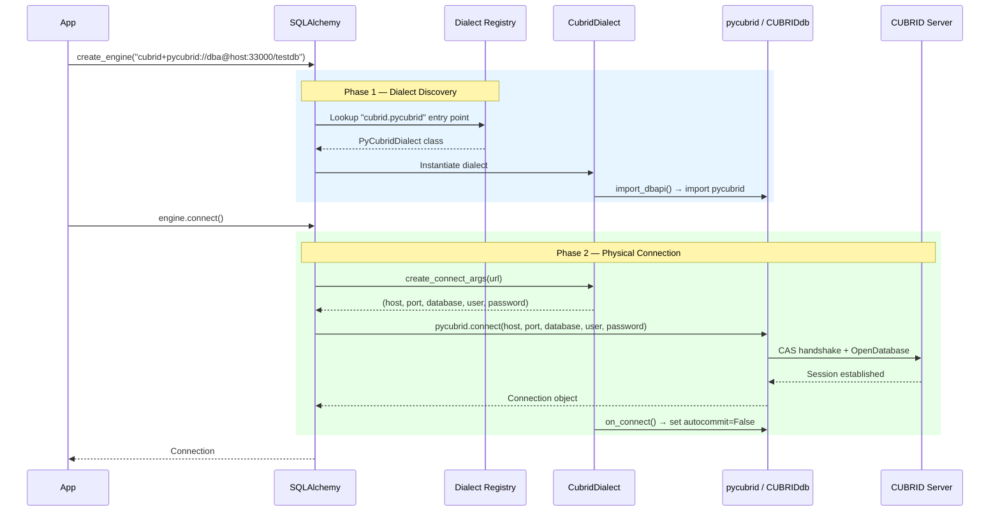
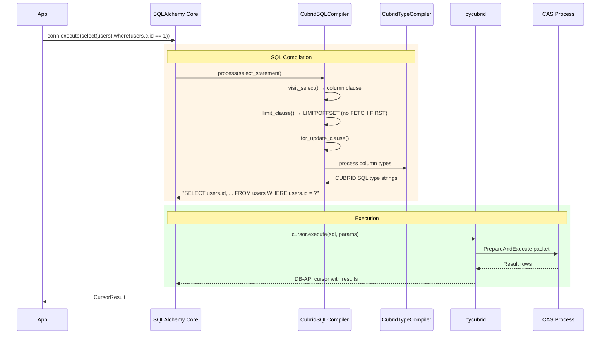
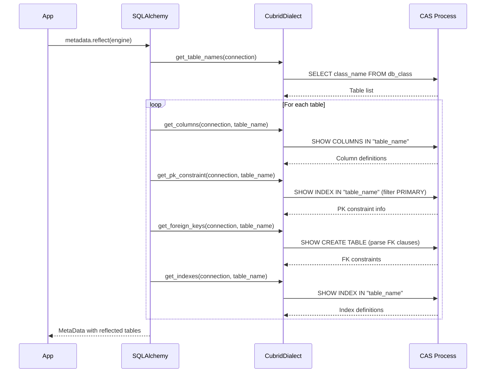
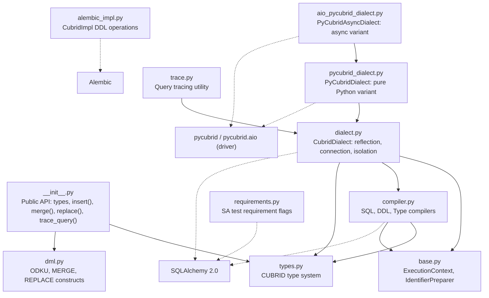
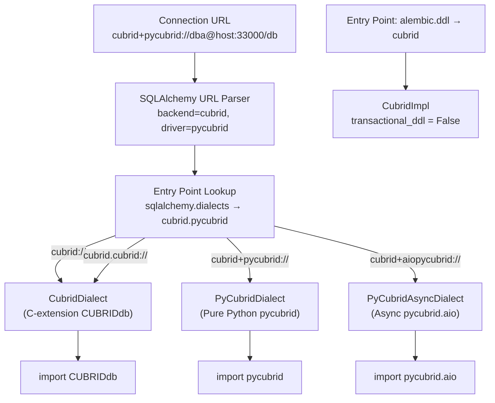
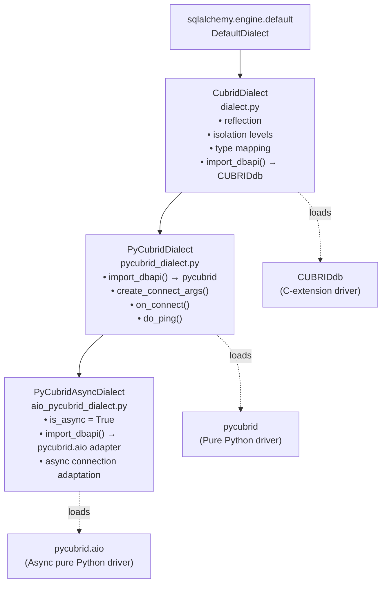

# Architecture

## Design Objectives
sqlalchemy-cubrid is designed to provide a robust, modern interface between SQLAlchemy and the CUBRID database. Its core design goals include:

*   Full SQLAlchemy 2.0–2.1 dialect implementation
*   Three driver modes (C-extension CUBRIDdb + pure Python pycubrid + async pycubrid.aio)
*   Schema reflection (tables, columns, constraints, indexes, comments)
*   Custom DML extensions (ON DUPLICATE KEY UPDATE, MERGE, REPLACE)
*   Alembic migration support
*   PEP 561 typed

## High-Level Flow

### Phase 1: Engine Creation & Connection
This phase covers how SQLAlchemy discovers the CUBRID dialect and establishes a physical connection to the CUBRID Server.



### Phase 2: SQL Compilation
This phase describes the transformation of SQLAlchemy Expression Language constructs into CUBRID-compatible SQL strings and their subsequent execution.



## Schema Reflection
The reflection process allows SQLAlchemy to inspect an existing CUBRID database and reconstruct Table objects automatically.



## Module Boundaries
The package is organized into specialized modules, each handling a specific aspect of the dialect's functionality.



### Module Descriptions

#### `__init__.py`
Defines the public API boundary, exporting CUBRID-specific types and DML extensions like `insert()`, `merge()`, and `replace()`. It serves as the primary entry point for users of the dialect.

#### `dialect.py`
Contains the base `CubridDialect` class, implementing core logic for schema reflection, connection management, and transaction isolation levels. It defaults to the C-extension driver `CUBRIDdb`.

#### `pycubrid_dialect.py`
Implements the `PyCubridDialect` variant, which uses the pure Python `pycubrid` driver. It overrides connection argument parsing and connection-time initialization logic.

#### `aio_pycubrid_dialect.py`
Implements `PyCubridAsyncDialect`, the async dialect variant used by `cubrid+aiopycubrid://`. It adapts `pycubrid.aio` for SQLAlchemy's async engine and `AsyncSession` APIs.

#### `compiler.py`
Houses the SQL, DDL, and Type compilers. It translates SQLAlchemy's abstract syntax trees into CUBRID-specific SQL dialects, handling nuances like LIMIT/OFFSET and FOR UPDATE clauses.

#### `base.py`
Provides the `CubridExecutionContext` for statement execution state and the `CubridIdentifierPreparer` for handling CUBRID's lowercase identifier folding and quoting rules.

#### `dml.py`
Defines custom DML constructs for CUBRID-specific features such as `ON DUPLICATE KEY UPDATE` (ODKU), `MERGE INTO`, and `REPLACE INTO`.

#### `types.py`
Implements the CUBRID-specific type system, mapping SQLAlchemy's generic types to CUBRID's internal types like `SET`, `MULTISET`, and `BIT`.

#### `trace.py`
Provides the `trace_query()` utility for enabling CUBRID query tracing around a statement execution and returning trace output for debugging and performance analysis.

#### `requirements.py`
Defines feature flags used by the SQLAlchemy test suite to determine which behavioral tests should be executed against a CUBRID backend.

#### `alembic_impl.py`
Provides the `CubridImpl` class for Alembic, enabling DDL migration support and defining CUBRID's lack of transactional DDL capabilities.

## Dialect Discovery
SQLAlchemy uses entry points to discover and load the appropriate dialect class based on the provided connection URL.



## Driver Architecture
The dialect supports the legacy C-extension driver, the modern pure Python driver, and the async pycubrid.aio variant through a hierarchical class structure.



## Key Design Decisions

*   **SQLAlchemy < 2.2 pin**: Uses three remaining private SA attributes (`select._limit_clause`, `select._offset_clause`, `select._for_update_arg`) via `_compat.py` helpers at compiler.py:93, 104-105 — requires version pinning until public alternatives exist.
*   **BOOLEAN → SMALLINT mapping**: CUBRID has no native BOOLEAN — dialect maps to `SMALLINT` (0/1).
*   **JSON type support (v1.2.0+)**: Full JSON type mapping including `JSON`, `JSONIndexType`, `JSONPathType`, with path access via `json_getattr` and `json_getitem_op`. Requires CUBRID ≥ 10.2.
*   **`transactional_ddl = False`**: CUBRID auto-commits DDL statements — Alembic cannot roll back failed migrations.
*   **`supports_statement_cache = True`**: Required for SA 2.0 performance — dialect is cache-safe.
*   **Lowercase identifier folding**: CUBRID folds to lowercase (not SQL-standard uppercase) — `CubridIdentifierPreparer` handles this.
*   **No RELEASE SAVEPOINT**: CUBRID doesn't support it — `do_release_savepoint()` is a no-op.

## Public API Boundary

```python
# DML Extensions
insert()    # Insert with .on_duplicate_key_update()
merge()     # MERGE INTO ... USING ... ON ... WHEN MATCHED/NOT MATCHED
replace()   # REPLACE INTO
trace_query() # Query tracing utility

# Types (CUBRID-specific)
STRING, BIT, CLOB, BLOB, SET, MULTISET, SEQUENCE, MONETARY, OBJECT
JSON, JSONIndexType, JSONPathType
NCHAR, NVARCHAR, DOUBLE_PRECISION, REAL

# Types (standard, re-exported)
SMALLINT, INTEGER, BIGINT, NUMERIC, DECIMAL, FLOAT, DOUBLE
CHAR, VARCHAR, DATE, TIME, TIMESTAMP, DATETIME

# Entry Points (registered via pyproject.toml)
cubrid://          → CubridDialect
cubrid.cubrid://   → CubridDialect  
cubrid+pycubrid:// → PyCubridDialect
cubrid+aiopycubrid:// → PyCubridAsyncDialect
cubrid (alembic)   → CubridImpl
```

## What This Package Owns / Does Not Own

### Owns
*   SQLAlchemy dialect for CUBRID
*   SQL compilation (SELECT/INSERT/UPDATE/DELETE with CUBRID syntax)
*   DDL compilation
*   Type mapping
*   Schema reflection
*   DML extensions (ODKU, MERGE, REPLACE)
*   Alembic DDL support
*   Identifier quoting

### Does Not Own
*   The CUBRID driver itself (use pycubrid or CUBRIDdb)
*   Connection pooling (SQLAlchemy handles this)
*   ORM model definitions (user code)
*   The CAS wire protocol (pycubrid handles this)
*   Query optimization (CUBRID server handles this)

## Related Documents
*   [Connection Guide](CONNECTION.md)
*   [Type System](TYPES.md)
*   [Isolation Levels](ISOLATION_LEVELS.md)
*   [DML Extensions](DML_EXTENSIONS.md)
*   [Alembic Guide](ALEMBIC.md)
*   [Feature Support](FEATURE_SUPPORT.md)
*   [Support Matrix](SUPPORT_MATRIX.md)
*   [Driver Compatibility](DRIVER_COMPAT.md)
