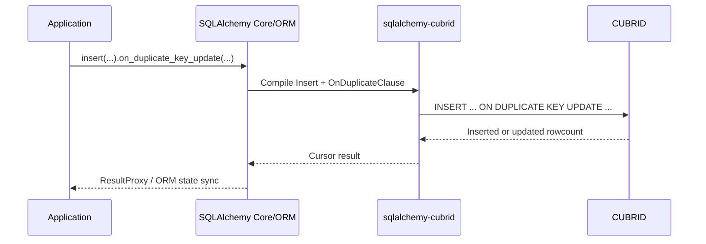
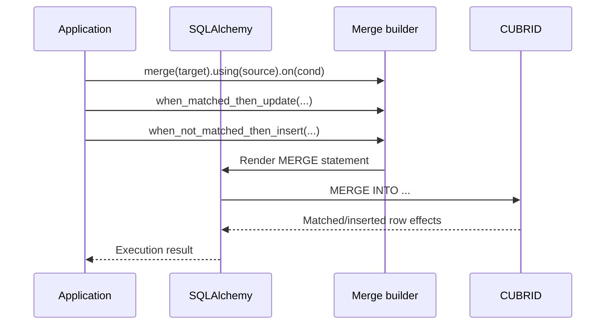

# CUBRID-Specific DML Constructs

This dialect provides custom SQLAlchemy constructs for CUBRID-specific DML (Data Manipulation Language) features that go beyond the standard SQLAlchemy API.

---

## Table of Contents

- [ON DUPLICATE KEY UPDATE](#on-duplicate-key-update)
  - [Basic Usage](#basic-usage)
  - [Referencing Inserted Values](#referencing-inserted-values)
  - [Argument Forms](#argument-forms)
- [REPLACE INTO](#replace-into)
  - [Basic Usage](#basic-usage-2)
  - [Behavior Notes](#behavior-notes)
- [MERGE Statement](#merge-statement)
  - [Basic Usage](#basic-usage-3)
  - [MERGE with WHERE Clauses](#merge-with-where-clauses)
  - [MERGE with DELETE WHERE](#merge-with-delete-where)
  - [Builder Methods](#builder-methods)
- [GROUP_CONCAT](#group_concat)
- [TRUNCATE TABLE](#truncate-table)
- [FOR UPDATE](#for-update)
- [UPDATE with LIMIT](#update-with-limit)
- [Index Hints](#index-hints)
  - [USING INDEX](#using-index)
  - [USE / FORCE / IGNORE INDEX](#use--force--ignore-index)
- [Query Trace](#query-trace)

---

## ON DUPLICATE KEY UPDATE

CUBRID supports `INSERT … ON DUPLICATE KEY UPDATE` with `VALUES()` references, identical to MySQL's pre-8.0 syntax.

### Basic Usage

```python
from sqlalchemy_cubrid import insert

stmt = insert(users).values(id=1, name="alice", email="alice@example.com")
stmt = stmt.on_duplicate_key_update(name="updated_alice")
```

**Generated SQL:**

```sql
INSERT INTO users (id, name, email)
VALUES (1, 'alice', 'alice@example.com')
ON DUPLICATE KEY UPDATE name = 'updated_alice'
```

### Referencing Inserted Values

Use `stmt.inserted` to reference the values being inserted — rendered as `VALUES(column_name)` in SQL:

```python
from sqlalchemy_cubrid import insert

stmt = insert(users).values(id=1, name="alice", email="alice@example.com")
stmt = stmt.on_duplicate_key_update(
    name=stmt.inserted.name,      # → VALUES(name)
    email=stmt.inserted.email,    # → VALUES(email)
)
```

**Generated SQL:**

```sql
INSERT INTO users (id, name, email)
VALUES (1, 'alice', 'alice@example.com')
ON DUPLICATE KEY UPDATE name = VALUES(name), email = VALUES(email)
```

### Argument Forms

The `on_duplicate_key_update()` method accepts three argument forms:

```python
# 1. Keyword arguments
stmt.on_duplicate_key_update(name="value", email="value")

# 2. Dictionary
stmt.on_duplicate_key_update({"name": "value", "email": "value"})

# 3. List of tuples (preserves column ordering)
stmt.on_duplicate_key_update([
    ("name", "value"),
    ("email", "value"),
])
```

> **Note**: You cannot mix keyword arguments with positional arguments (dict/list). Choose one form per call.

### Subquery Values in ON DUPLICATE KEY UPDATE

CUBRID supports using subquery expressions as update values in the ON DUPLICATE KEY UPDATE clause:

```python
from sqlalchemy_cubrid import insert
import sqlalchemy as sa

stmt = insert(users).values(id=1, name="alice", email="alice@example.com")
stmt = stmt.on_duplicate_key_update(
    name=sa.select(sa.func.max(users.c.name)).scalar_subquery()
)
```

**Generated SQL:**

```sql
INSERT INTO users (id, name, email)
VALUES (1, 'alice', 'alice@example.com')
ON DUPLICATE KEY UPDATE name = (SELECT max(users.name) FROM users)
```

> **Note**: `stmt.inserted.<column>` compiles to `VALUES(<column>)`, which is the dialect's supported way to reference the incoming row in ON DUPLICATE KEY UPDATE clauses.

---

## REPLACE INTO

CUBRID supports `REPLACE INTO`, which uses INSERT-like syntax and replaces existing rows on duplicate-key conflicts.

### Basic Usage

```python
from sqlalchemy_cubrid import replace

stmt = replace(users).values(id=1, name="alice", email="alice@example.com")
```

**Generated SQL:**

```sql
REPLACE INTO users (id, name, email)
VALUES (1, 'alice', 'alice@example.com')
```

### Behavior Notes

- `REPLACE INTO` uses all standard INSERT value patterns (`values`, `from_select`, etc.)
- On duplicate key conflicts, CUBRID replaces the existing row with the new row
- `REPLACE INTO` does not support `ON DUPLICATE KEY UPDATE`; use `insert(...).on_duplicate_key_update(...)` for in-place updates

---

## MERGE Statement

CUBRID supports the full SQL `MERGE` statement for conditional INSERT/UPDATE in a single operation.

### Basic Usage

```python
from sqlalchemy_cubrid.dml import merge

stmt = (
    merge(target_table)
    .using(source_table)
    .on(target_table.c.id == source_table.c.id)
    .when_matched_then_update(
        {"name": source_table.c.name, "email": source_table.c.email}
    )
    .when_not_matched_then_insert(
        {
            "id": source_table.c.id,
            "name": source_table.c.name,
            "email": source_table.c.email,
        }
    )
)
```

**Generated SQL:**

```sql
MERGE INTO target_table
USING source_table
ON (target_table.id = source_table.id)
WHEN MATCHED THEN UPDATE SET name = source_table.name, email = source_table.email
WHEN NOT MATCHED THEN INSERT (id, name, email)
  VALUES (source_table.id, source_table.name, source_table.email)
```

### MERGE with WHERE Clauses

Both `WHEN MATCHED` and `WHEN NOT MATCHED` clauses support optional `WHERE` filters:

```python
stmt = (
    merge(target_table)
    .using(source_table)
    .on(target_table.c.id == source_table.c.id)
    .when_matched_then_update(
        {"name": source_table.c.name},
        where=source_table.c.name.is_not(None),  # Only update non-null names
    )
    .when_not_matched_then_insert(
        {"id": source_table.c.id, "name": source_table.c.name},
        where=source_table.c.name.is_not(None),  # Only insert non-null names
    )
)
```

**Generated SQL:**

```sql
MERGE INTO target_table
USING source_table
ON (target_table.id = source_table.id)
WHEN MATCHED THEN UPDATE SET name = source_table.name
  WHERE source_table.name IS NOT NULL
WHEN NOT MATCHED THEN INSERT (id, name)
  VALUES (source_table.id, source_table.name)
  WHERE source_table.name IS NOT NULL
```

### MERGE with DELETE WHERE

CUBRID supports `DELETE WHERE` within a `WHEN MATCHED` clause to conditionally delete rows:

```python
stmt = (
    merge(target_table)
    .using(source_table)
    .on(target_table.c.id == source_table.c.id)
    .when_matched_then_update(
        {"name": source_table.c.name},
        delete_where=target_table.c.active == False,
    )
    .when_not_matched_then_insert(
        {"id": source_table.c.id, "name": source_table.c.name}
    )
)
```

**Generated SQL:**

```sql
MERGE INTO target_table
USING source_table
ON (target_table.id = source_table.id)
WHEN MATCHED THEN UPDATE SET name = source_table.name
  DELETE WHERE target_table.active = 0
WHEN NOT MATCHED THEN INSERT (id, name)
  VALUES (source_table.id, source_table.name)
```

You can also add `DELETE WHERE` separately via `when_matched_then_delete()`:

```python
stmt = (
    merge(target_table)
    .using(source_table)
    .on(target_table.c.id == source_table.c.id)
    .when_matched_then_update({"name": source_table.c.name})
    .when_matched_then_delete(where=target_table.c.active == False)
    .when_not_matched_then_insert(
        {"id": source_table.c.id, "name": source_table.c.name}
    )
)
```

### Builder Methods

| Method                                                       | Description                                    |
|--------------------------------------------------------------|------------------------------------------------|
| `merge(target)`                                              | Factory function — sets the target table       |
| `.using(source)`                                             | Source table or subquery                        |
| `.on(condition)`                                             | Join condition                                 |
| `.when_matched_then_update(values, where=, delete_where=)`   | WHEN MATCHED → UPDATE SET clause               |
| `.when_matched_then_delete(where=)`                          | Adds DELETE WHERE to existing WHEN MATCHED     |
| `.when_not_matched_then_insert(values, where=)`              | WHEN NOT MATCHED → INSERT clause               |

**Requirements:**
- `using()` and `on()` are mandatory
- At least one of `when_matched_then_update` or `when_not_matched_then_insert` must be specified
- `when_matched_then_delete` can only be called after `when_matched_then_update`

---

## GROUP_CONCAT

CUBRID supports `GROUP_CONCAT` as an aggregate function:

```python
import sqlalchemy as sa

# Basic GROUP_CONCAT
stmt = sa.select(sa.func.group_concat(users.c.name))
# → SELECT GROUP_CONCAT(users.name) FROM users

# With GROUP BY
stmt = (
    sa.select(
        users.c.department,
        sa.func.group_concat(users.c.name),
    )
    .group_by(users.c.department)
)
# → SELECT users.department, GROUP_CONCAT(users.name)
#   FROM users GROUP BY users.department
```

CUBRID's `GROUP_CONCAT` supports `DISTINCT`, `ORDER BY`, and `SEPARATOR` modifiers at the SQL level, though the standard `sa.func.group_concat()` API provides access to basic usage.

---

## TRUNCATE TABLE

CUBRID supports `TRUNCATE TABLE`, which is faster than `DELETE` for removing all rows:

```python
from sqlalchemy import text

with engine.begin() as conn:
    conn.execute(text("TRUNCATE TABLE temp_data"))
```

The dialect includes `TRUNCATE` in its autocommit detection pattern, so it will be executed with autocommit enabled (matching CUBRID's implicit DDL commit behavior).

---

## FOR UPDATE

CUBRID supports `SELECT … FOR UPDATE` for row-level locking:

```python
import sqlalchemy as sa

# Basic FOR UPDATE
stmt = sa.select(users).where(users.c.id == 1).with_for_update()
# → SELECT ... FROM users WHERE users.id = 1 FOR UPDATE

# FOR UPDATE OF specific columns
stmt = (
    sa.select(users)
    .where(users.c.id == 1)
    .with_for_update(of=[users.c.name, users.c.email])
)
# → SELECT ... FROM users WHERE users.id = 1 FOR UPDATE OF users.name, users.email
```

> **Note**: CUBRID does **not** support `NOWAIT` or `SKIP LOCKED` modifiers. Using them will have no effect.

---

## UPDATE with LIMIT

CUBRID supports `UPDATE … LIMIT n` to restrict the number of rows affected:

```python
from sqlalchemy import update

stmt = (
    update(users)
    .values(status="inactive")
    .where(users.c.last_login < "2025-01-01")
)
stmt.kwargs["cubrid_limit"] = 100
# → UPDATE users SET status = 'inactive'
#   WHERE users.last_login < '2025-01-01'
#   LIMIT 100
```

> **Note**: The compiler reads `stmt.kwargs["cubrid_limit"]` for this extension. This is a CUBRID/MySQL extension; PostgreSQL and SQLite do not support `UPDATE … LIMIT`.

---

## Index Hints

CUBRID supports index hints in SELECT queries. Use SQLAlchemy's built-in hint mechanisms — no custom dialect constructs are needed.

### USING INDEX

```python
import sqlalchemy as sa

# Using with_hint (dialect-specific — only emitted for CUBRID)
stmt = (
    sa.select(users)
    .with_hint(users, "USING INDEX idx_users_name", dialect_name="cubrid")
)

# Using suffix_with (always emitted)
stmt = sa.select(users).suffix_with("USING INDEX idx_users_name")
```

### USE / FORCE / IGNORE INDEX

```python
# USE INDEX
stmt = (
    sa.select(users)
    .with_hint(users, "USE INDEX (idx_users_name)", dialect_name="cubrid")
)

# FORCE INDEX
stmt = (
    sa.select(users)
    .with_hint(users, "FORCE INDEX (idx_users_email)", dialect_name="cubrid")
)

# IGNORE INDEX
stmt = (
    sa.select(users)
    .with_hint(users, "IGNORE INDEX (idx_users_old)", dialect_name="cubrid")
)
```

> **Portability tip**: When using `with_hint(dialect_name="cubrid")`, the hint is only emitted when compiling against the CUBRID dialect. Other dialects will ignore it, making your code safely portable across database backends.

---

## Query Trace

CUBRID does not support the standard SQL `EXPLAIN` statement. Instead, it provides a session-level trace facility via `SET TRACE ON` / `SHOW TRACE` commands.

The `trace_query()` utility wraps this workflow:

```python
from sqlalchemy import create_engine, text
from sqlalchemy_cubrid.trace import trace_query

engine = create_engine("cubrid://dba@localhost:33000/demodb")
with engine.connect() as conn:
    traces = trace_query(conn, text("SELECT * FROM users WHERE id = 1"))
    for line in traces:
        print(line)
```

**How it works:**

1. `SET TRACE ON` — enables trace collection for the session
2. Executes the provided SQL statement
3. `SHOW TRACE` — retrieves trace statistics
4. `SET TRACE OFF` — disables trace (always, even on error)

**Trace output** includes execution statistics such as query time, fetch count, and I/O operations.

> **Note**: `trace_query()` requires a live CUBRID connection. It cannot be used in offline (compilation-only) mode. The trace is session-scoped and does not affect other connections.

---

## Cookbook: Production DML Patterns

### 1) Atomic counters with `ON DUPLICATE KEY UPDATE`

```python
from sqlalchemy import func
from sqlalchemy_cubrid import insert

stmt = (
    insert(daily_metrics)
    .values(metric_date="2026-04-06", page_views=1)
    .on_duplicate_key_update(
        page_views=daily_metrics.c.page_views + 1,
        updated_at=func.current_datetime(),
    )
)
```

Use this pattern for idempotent event aggregation without read-before-write.

### 2) Preserve column update order

`on_duplicate_key_update()` accepts list-of-tuples so SQL column ordering is deterministic:

```python
stmt = (
    insert(accounts)
    .values(id=100, status="active", updated_by="system")
    .on_duplicate_key_update([
        ("status", "active"),
        ("updated_by", "system"),
    ])
)
```

This mirrors the internal `_parameter_ordering` behavior in `OnDuplicateClause`.

### 3) Idempotent sync with incoming values

```python
stmt = insert(users).values(id=1, name="Alice", email="alice@example.com")
stmt = stmt.on_duplicate_key_update(
    name=stmt.inserted.name,
    email=stmt.inserted.email,
)
```

### 4) Batch ingest from staging table with `MERGE`

```python
from sqlalchemy import select
from sqlalchemy_cubrid import merge

source = (
    select(staging_users.c.user_id, staging_users.c.name, staging_users.c.email)
    .where(staging_users.c.is_valid == 1)
    .subquery()
)

stmt = (
    merge(users)
    .using(source)
    .on(users.c.id == source.c.user_id)
    .when_matched_then_update(
        {
            "name": source.c.name,
            "email": source.c.email,
        },
        where=source.c.email.is_not(None),
    )
    .when_not_matched_then_insert(
        {
            "id": source.c.user_id,
            "name": source.c.name,
            "email": source.c.email,
        }
    )
)
```

### 5) Soft-delete invalid rows during `MERGE`

```python
stmt = (
    merge(products)
    .using(source_products)
    .on(products.c.sku == source_products.c.sku)
    .when_matched_then_update(
        {"name": source_products.c.name},
        delete_where=source_products.c.discontinued == 1,
    )
    .when_not_matched_then_insert(
        {
            "sku": source_products.c.sku,
            "name": source_products.c.name,
        }
    )
)
```

### 6) Safe `REPLACE INTO` for immutable snapshots

```python
from sqlalchemy_cubrid import replace

stmt = replace(user_daily_snapshot).values(
    user_id=42,
    snapshot_date="2026-04-06",
    payload="{...}",
)
```

Use `REPLACE` for full-row replacement workloads where delete+insert semantics are acceptable.

---

## DML Execution Flow

### `ON DUPLICATE KEY UPDATE`



### `MERGE`



---

## Gotchas and Limitations

!!! warning "Do not pass empty update mappings"
    `on_duplicate_key_update({})` raises an error.
    Pass a non-empty dict, `ColumnCollection`, or list of `(key, value)` tuples.

!!! warning "Do not mix positional and keyword arguments"
    `on_duplicate_key_update()` enforces a single input style:
    either positional (`dict`/`list[tuple]`) or keyword args.

!!! warning "MERGE requires `using()` and `on()`"
    Missing `using()` or `on()` generates invalid SQL. Always provide both before execution.

!!! warning "`when_matched_then_delete()` requires prior update clause"
    In this dialect implementation, `when_matched_then_delete()` must be called after `when_matched_then_update()`.

!!! tip "Prefer ODKU for high-frequency single-row upserts"
    `ON DUPLICATE KEY UPDATE` is usually simpler and lower overhead than `MERGE` for key-based singleton updates.

---

## Performance Notes

| Pattern | Best Fit | Relative Cost | Notes |
|---|---|---|---|
| `INSERT ... ON DUPLICATE KEY UPDATE` | Single-row or small upserts on unique key | Low | Efficient conflict handling in one statement. |
| `MERGE` | Set-based sync from source table/subquery | Medium | Most expressive; can update/insert/delete with predicates. |
| `REPLACE INTO` | Full-row replacement semantics | Medium-High | Delete+insert behavior can trigger more index and FK work. |

Practical guidance:

1. Benchmark with representative cardinality and index layout.
2. Keep matched predicates sargable (`ON` keys indexed).
3. Use tuple ordering in ODKU when deterministic SQL text benefits statement cache behavior.

---

*See also: [Feature Support](FEATURE_SUPPORT.md) · [Type Mapping](TYPES.md) · [Connection Setup](CONNECTION.md)*
