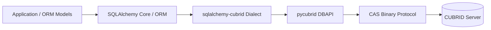
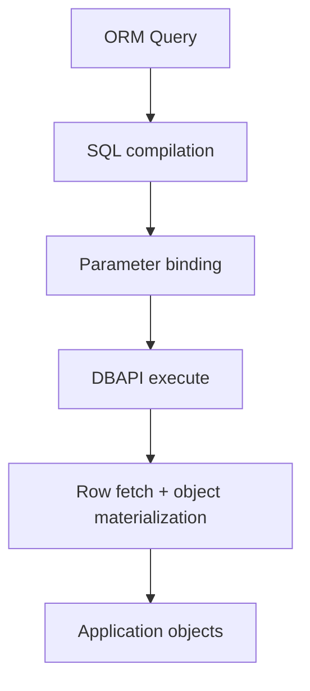
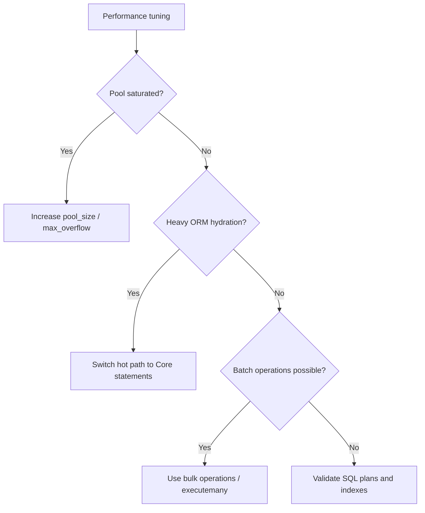

# Performance Guide

This guide covers observed performance for `sqlalchemy-cubrid` and practical optimization patterns.

---

## Table of Contents

- [Overview](#overview)
- [Benchmark Results](#benchmark-results)
- [Performance Characteristics](#performance-characteristics)
- [Optimization Tips](#optimization-tips)
- [Running Benchmarks](#running-benchmarks)

---

## Overview

`sqlalchemy-cubrid` adds SQLAlchemy Core/ORM behavior on top of the CUBRID Python driver.

---

## Benchmark Results

Source: [cubrid-benchmark](https://github.com/cubrid-lab/cubrid-benchmark)

Environment: Intel Core i5-9400F @ 2.90GHz, 6 cores, Linux x86_64, Docker containers.

Baseline driver workload: Python `pycubrid` vs `PyMySQL`, 10000 rows x 5 rounds.

| Scenario | CUBRID (pycubrid baseline) | MySQL (PyMySQL) | Ratio (CUBRID/MySQL) |
|---|---:|---:|---:|
| insert_sequential | 10.47s | 1.74s | 6.0x |
| select_by_pk | 15.99s | 3.52s | 4.5x |
| select_full_scan | 10.31s | 1.86s | 5.5x |
| update_indexed | 10.70s | 2.19s | 4.9x |
| delete_sequential | 10.75s | 2.10s | 5.1x |

Note: SQLAlchemy adds extra overhead for SQL compilation, ORM identity mapping, and object creation.

### Issue #104 — ORM dialect profile and optimization

Measured on the local benchmark environment used for Issue #104:

| Scenario | Before | After | Delta |
|---|---:|---:|---:|
| Tier 2 single-row CRUD (mean) | 155.99 ms | 268.41 ms | 72.1% slower* |
| Tier 2 bulk insert (100 rows, mean) | 370.33 ms | 356.09 ms | **3.9% faster** |
| Tier 2 bulk insert (1000 rows, mean) | 2864.56 ms | 2511.52 ms | **12.3% faster** |
| Tier 2 query builder select-all (mean) | 39.76 ms | 31.83 ms | **19.9% faster** |

Profiling with `scripts/profile_orm.py` showed that dialect-layer self time is a very small fraction of total
request time on CRUD-heavy ORM paths, with most elapsed time still spent in SQLAlchemy ORM/Core coordination
and the `pycubrid` driver. In the profiled workload captured for Issue #104:

- dialect-layer self time was **0.0009% of total request time**
- SQLAlchemy Core self time was **6.55% of total request time**
- `pycubrid` self time was **7.01% of total request time**
- ORM select overhead vs raw SQL select was **18.08% of ORM select time**

Top dialect-layer hotspots from the compilation-focused profiler pass were:

1. `compiler.py:visit_on_duplicate_key_update`
2. `compiler.py:limit_clause`
3. `compiler.py:update_limit_clause`
4. `compiler.py:<dictcomp>` inside `visit_on_duplicate_key_update`
5. `compiler.py:replace` inside `visit_on_duplicate_key_update`

Shipped optimization:

- Enabled SQLAlchemy 2.x `insertmanyvalues` for the CUBRID dialect (`use_insertmanyvalues=True` and
  `use_insertmanyvalues_wo_returning=True`) so ORM bulk inserts can batch into multi-values INSERT forms
  without changing the public API.

\* The single-row CRUD benchmark showed high variance in this local run, so the clear repeatable improvement from
this change set is the bulk insert path rather than singleton unit-of-work latency.

---

## Performance Characteristics

- The dialect inherits `pycubrid` transport behavior and CAS protocol costs.
- Core query compilation is fast but non-zero; repeated dynamic SQL can accumulate overhead.
- ORM paths add identity map and model materialization costs compared to raw DBAPI usage.
- Pool configuration strongly impacts latency under concurrency.
- Bulk APIs and Core statements generally outperform row-by-row ORM unit-of-work patterns.

---

## Optimization Tips

- Configure pooling explicitly (example: `pool_size`, `max_overflow`, `pool_pre_ping=True`).
- Use SQLAlchemy Core for high-volume bulk writes and large read pipelines.
- Use `executemany`-friendly patterns for insert/update bursts.
- Keep transactions explicit and avoid autocommit-style tiny transactions.
- Limit ORM object hydration when only scalar/tuple output is needed.

---

## Running Benchmarks

1. Clone: `git clone https://github.com/cubrid-lab/cubrid-benchmark`.
2. Start the benchmark database containers per the benchmark documentation.
3. Run the Python benchmark suite to establish DBAPI baseline metrics.
4. Run SQLAlchemy-specific scenarios on the same host and dataset shape.
5. Compare driver baseline vs ORM/Core runs to isolate framework overhead.

Use the benchmark repository documentation for the exact command set and runner scripts.
